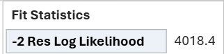

# Background

This document outlines steps taken to determine the procedure needed to get the same type-II ANOVA results as SAS. We were running into issues when the model had no intercept and the first effect containing a categorical variable had an aliased term.

```{r setup, message=FALSE}
library(car)
library(mmrm)
library(here)
library(haven)
library(tidyverse)
```

# Prepare data set

We first create a modified version of the `fev_data` data set. We drop rows with a missing outcome variable (`FEV1`). Because SAS utilizes all levels of all categorical variables when building its models, we create the numeric binary variable `female` out of the binary `SEX` variable. This ensures that we obtain the same number of parameters as `mmrm`. Finally, because SAS puts reference levels last, we relevel the `ARMCD` so that `TRT` is the first factor level.

```{r}
fev_data_numeric_sex <-
  fev_data |> 
  drop_na(FEV1) |> 
  mutate(
    female = as.integer(SEX == "Female"),
    ARMCD = fct_relevel(ARMCD, "TRT")
  ) |> 
  select(FEV1, FEV1_BL, ARMCD, SEX, female, AVISIT, USUBJID)
head(fev_data_numeric_sex)
# write_csv(here("design", "anova", "type2", "fev_data_numeric_sex.csv"))
```

# Obtain `mmrm` model

The test model in question whose type-II ANOVA results were eluding us was this one:

```{r}
fit <-
  mmrm(
    FEV1 ~
      ARMCD:FEV1_BL + FEV1_BL - 1 + ARMCD:female +
      ar1(as.ordered(AVISIT) | USUBJID),
    data = fev_data_numeric_sex
  )
fit
```

# Obtain SAS model

Now we run this code in SAS to import the code, create the model, and obtain the type-II ANOVA results:

```{sas eval=FALSE}
PROC IMPORT DATAFILE="/path/to/fev_data_numeric_sex.csv"
    OUT=WORK.fev_data
    DBMS=CSV
    REPLACE;
    GETNAMES=YES;
    GUESSINGROWS=MAX;
RUN;

ODS OUTPUT SOLUTIONF=solution TESTS2=anova_ii COEF=contrasts;
PROC MIXED DATA=WORK.fev_data METHOD=REML COVTEST;
  CLASS USUBJID AVISIT ARMCD(REF="PBO");
  MODEL FEV1 =
      FEV1_BL
      ARMCD * FEV1_BL
      ARMCD * female / NOINT SOLUTION HTYPE=2 DDFM=SATTERTHWAITE CHISQ E2; 
  REPEATED AVISIT / SUBJECT=USUBJID TYPE=AR(1);
RUN;
```

We import the results here.

```{r}
sas_solution <- read_sas(here("design", "anova", "type2", "solution.sas7bdat"))
sas_anova_ii <- read_sas(here("design", "anova", "type2", "anova_ii.sas7bdat"))
sas_contrasts <- read_sas(here("design", "anova", "type2", "contrasts.sas7bdat"))
```

Comparing the model coefficients with the `mmrm` model, we see that they are very close. Note that `mmrm` drops aliased parameters from the model (`NA`), whereas SAS zeroes them out.

```{r}
sas_solution |> 
  reframe(
    Effect = str_replace(Effect, "ARMCD", paste0("ARMCD", ARMCD)),
    Estimate
  ) |> 
  deframe() |> 
  c()
```

We also see that the -2*log-likelihood is very close:



This gives us confidence that we are dealing with the same model.

# View SAS contrast matrices

Now we view the SAS contrast matrices to see how they should be constructed:

```{r}
sas_contrasts_tbl <-
  sas_contrasts |> 
  mutate(Effect = str_replace(Effect, "ARMCD", ARMCD)) |> 
  pivot_longer(
    starts_with("Row"),
    names_to = "row", names_transform = \(x) as.integer(str_sub(x, 4, 4)),
    values_to = "value",
    values_drop_na = TRUE
  ) |> 
  pivot_wider(
    id_cols =
      c(LMatrix, row),
    names_from = Effect, 
    values_from = value
  ) |> 
  mutate(LMatrix = c("FEV1_BL", "FEV1_BL*ARMCD", "female*ARMCD")[LMatrix])

sas_contrasts_tbl |> 
  split(sas_contrasts_tbl$LMatrix) |> 
  lapply(select, -1:-2)
```

Notice that SAS retains aliased/zeroed out columns when building the contrast matrix. Notice also that for the effect `FEV1_BL*ARMCD`, its single-row contrast matrix has a -1 in the column corresponding to the reference level. 

Taking what we've learned here, we tweaked the type-II contrast creation helper function `h_type2_contrast()` so that it builds the matrices using all columns, including the aliased ones. Furthermore, when a model does not contain an intercept, it assigns a column of straight -1s to the extra parameter column corresponding to the first effect to contain a categorical variable.

# Comparing Type-II ANOVA results

See SAS's type-II ANOVA results:

```{r}
sas_anova_ii
```

See now `car::Anova()`'s type-II results, using both the F test and the Chi-squared test:

```{r}
car::Anova(fit, type = "II", test.statistic = "F")
car::Anova(fit, type = "II", test.statistic = "Chisq")
```

The results appear to be the same in spite of the curveballs of a lack of an intercept and an aliased parameter within the categorical variable containing the intercept.
