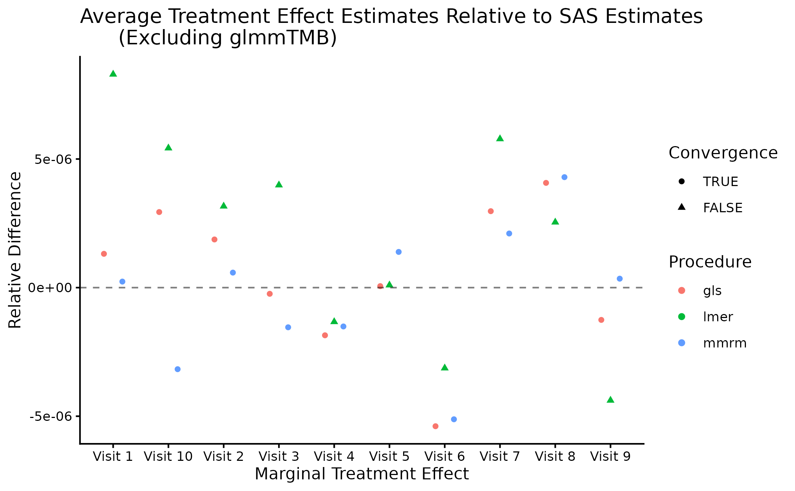

# Comparison with other software

## Introduction

In this vignette we briefly compare the
[`mmrm::mmrm`](https://openpharma.github.io/mmrm/reference/mmrm.md),
SAS’s `PROC GLIMMIX`,
[`nlme::gls`](https://rdrr.io/pkg/nlme/man/gls.html),
[`lme4::lmer`](https://rdrr.io/pkg/lme4/man/lmer.html), and
[`glmmTMB::glmmTMB`](https://rdrr.io/pkg/glmmTMB/man/glmmTMB.html)
functions for fitting mixed models for repeated measures (MMRMs). A
primary difference in these implementations lies in the covariance
structures that are supported “out of the box”. In particular,
`PROC GLIMMIX` and `mmrm` are the only procedures which provide support
for many of the most common MMRM covariance structures. Most covariance
structures can be implemented in `gls`, though users are required to
define them manually. `lmer` and `glmmTMB` are more limited. We find
that `mmmrm` converges more quickly than other R implementations while
also producing estimates that are virtually identical to
`PROC GLIMMIX`’s.

## Datasets

Two datasets are used to illustrate model fitting with the `mmrm`,
`lme4`, `nlme`, `glmmTMB` R packages as well as `PROC GLIMMIX`. These
data are also used to compare these implementations’ operating
characteristics.

### FEV Data

The FEV dataset contains measurements of FEV1 (forced expired volume in
one second), a measure of how quickly the lungs can be emptied. Low
levels of FEV1 may indicate chronic obstructive pulmonary disease
(COPD). It is summarized below.

                                          Stratified by ARMCD
                                   Overall       PBO           TRT
      n                              800           420           380
      USUBJID (%)
         PT[1-200]                   200           105 (52.5)     95 (47.5)
      AVISIT
         VIS1                        200           105            95
         VIS2                        200           105            95
         VIS3                        200           105            95
         VIS4                        200           105            95
      RACE (%)
         Asian                       280 (35.0)    152 (36.2)    128 (33.7)
         Black or African American   300 (37.5)    184 (43.8)    116 (30.5)
         White                       220 (27.5)     84 (20.0)    136 (35.8)
      SEX = Female (%)               424 (53.0)    220 (52.4)    204 (53.7)
      FEV1_BL (mean (SD))          40.19 (9.12)  40.46 (8.84)  39.90 (9.42)
      FEV1 (mean (SD))             42.30 (9.32)  40.24 (8.67)  44.45 (9.51)
      WEIGHT (mean (SD))            0.52 (0.23)   0.52 (0.23)   0.51 (0.23)
      VISITN (mean (SD))            2.50 (1.12)   2.50 (1.12)   2.50 (1.12)
      VISITN2 (mean (SD))          -0.02 (1.03)   0.01 (1.07)  -0.04 (0.98)

### BCVA Data

The BCVA dataset contains data from a randomized longitudinal
ophthalmology trial evaluating the change in baseline corrected visual
acuity (BCVA) over the course of 10 visits. BCVA corresponds to the
number of letters read from a visual acuity chart. A summary of the data
is given below:

                                          Stratified by ARMCD
                                   Overall         CTL            TRT
      n                             8605          4123           4482
      USUBJID (%)
         PT[1-1000]                 1000           494 (49.4)     506 (50.6)
      AVISIT
         VIS1                        983           482            501
         VIS2                        980           481            499
         VIS3                        960           471            489
         VIS4                        946           458            488
         VIS5                        925           454            471
         VIS6                        868           410            458
         VIS7                        816           388            428
         VIS8                        791           371            420
         VIS9                        719           327            392
         VIS10                       617           281            336
      RACE (%)
         Asian                       297 (29.7)    151 (30.6)     146 (28.9)
         Black or African American   317 (31.7)    149 (30.1)     168 (33.2)
         White                       386 (38.6)    194 (39.3)     192 (37.9)
      BCVA_BL (mean (SD))          75.12 (9.93)  74.90 (9.76)   75.40 (10.1)
      BCVA_CHG (mean (SD))
         VIS1                       5.59 (1.31)   5.32 (1.23)    5.86 (1.33)
         VIS10                      9.18 (2.91)   7.49 (2.58)   10.60 (2.36)

## Model Implementations

Listed below are some of the most commonly used covariance structures
used when fitting MMRMs. We indicate which matrices are available “out
of the box” for each implementation considered in this vignette. Note
that this table is not exhaustive; `PROC GLIMMIX` and `glmmTMB` support
additional spatial covariance structures.

| Covariance structures | `mmrm` | `PROC GLIMMIX` | `gls` | `lmer` | `glmmTMB` |
|:--:|:--:|:--:|:--:|:--:|:--:|
| Ante-dependence (heterogeneous) | X | X |  |  |  |
| Ante-dependence (homogeneous) | X |  |  |  |  |
| Auto-regressive (heterogeneous) | X | X | X |  |  |
| Auto-regressive (homogeneous) | X | X | X |  | X |
| Compound symmetry (heterogeneous) | X | X | X |  | X |
| Compound symmetry (homogeneous) | X | X | X |  |  |
| Spatial exponential | X | X | X |  | X |
| Toeplitz (heterogeneous) | X | X |  |  | X |
| Toeplitz (homogeneous) | X | X |  |  |  |
| Unstructured | X | X | X | X | X |

Code for fitting MMRMs to the FEV data using each of the considered
functions and covariance structures are provided below. Fixed effects
for the visit number, treatment assignment and the interaction between
the two are modeled.

### Ante-dependence (heterogeneous)

#### `PROC GLIMMIX`

    PROC GLIMMIX DATA = fev_data;
    CLASS AVISIT(ref = 'VIS1') ARMCD(ref = 'PBO') USUBJID;
    MODEL FEV1 = AVISIT|ARMCD / ddfm=satterthwaite solution chisq;
    RANDOM AVISIT / subject=USUBJID type=ANTE(1);

#### `mmrm`

    mmrm(
      formula = FEV1 ~ ARMCD * AVISIT + adh(VISITN | USUBJID),
      data = fev_data
    )

### Ante-dependence (homogeneous)

#### `mmrm`

    mmrm(
      formula =FEV1 ~ ARMCD * AVISIT + ad(VISITN | USUBJID),
      data = fev_data
    )

### Auto-regressive (heterogeneous)

#### `PROC GLIMMIX`

    PROC GLIMMIX DATA = fev_data;
    CLASS AVISIT(ref = 'VIS1') ARMCD(ref = 'PBO') USUBJID;
    MODEL FEV1 = AVISIT|ARMCD / ddfm=satterthwaite solution chisq;
    RANDOM AVISIT / subject=USUBJID type=ARH(1);

#### `mmrm`

    mmrm(
      formula = FEV1 ~ ARMCD * AVISIT + ar1h(VISITN | USUBJID),
      data = fev_data
    )

#### `gls`

    gls(
      FEV1 ~ ARMCD * AVISIT,
      data = fev_data,
      correlation = corAR1(form = ~AVISIT | USUBJID),
      weights = varIdent(form = ~1|AVISIT),
      na.action = na.omit
    )

### Auto-regressive (homogeneous)

#### `PROC GLIMMIX`

    PROC GLIMMIX DATA = fev_data;
    CLASS AVISIT(ref = 'VIS1') ARMCD(ref = 'PBO') USUBJID;
    MODEL FEV1 =  ARMCD|AVISIT / ddfm=satterthwaite solution chisq;
    RANDOM AVISIT / subject=USUBJID type=AR(1);

#### `mmrm`

    mmrm(
      formula = FEV1 ~ ARMCD * AVISIT + ar1(VISITN | USUBJID),
      data = fev_data
    )

#### `gls`

    gls(
      FEV1 ~ ARMCD * AVISIT,
      data = fev_data,
      correlation = corAR1(form = ~AVISIT | USUBJID),
      na.action = na.omit
    )

#### `glmmTMB`

    glmmTMB(
      FEV1 ~ ARMCD * AVISIT + ar1(0 + AVISIT | USUBJID),
      dispformula = ~ 0,
      data = fev_data
    )

### Compound symmetry (heterogeneous)

#### `PROC GLIMMIX`

    PROC GLIMMIX DATA = fev_data;
    CLASS AVISIT(ref = 'VIS1') ARMCD(ref = 'PBO') USUBJID;
    MODEL FEV1 = AVISIT|ARMCD / ddfm=satterthwaite solution chisq;
    RANDOM AVISIT / subject=USUBJID type=CSH;

#### `mmrm`

    mmrm(
      formula = FEV1 ~ ARMCD * AVISIT + csh(VISITN | USUBJID),
      data = fev_data
    )

#### `gls`

    gls(
      FEV1 ~ ARMCD * AVISIT,
      data = fev_data,
      correlation = corCompSymm(form = ~AVISIT | USUBJID),
      weights = varIdent(form = ~1|AVISIT),
      na.action = na.omit
    )

#### `glmmTMB`

    glmmTMB(
      FEV1 ~ ARMCD * AVISIT + cs(0 + AVISIT | USUBJID),
      dispformula = ~ 0,
      data = fev_data
    )

### Compound symmetry (homogeneous)

#### `PROC GLIMMIX`

    PROC GLIMMIX DATA = fev_data;
    CLASS AVISIT(ref = 'VIS1') ARMCD(ref = 'PBO') USUBJID;
    MODEL FEV1 = AVISIT|ARMCD / ddfm=satterthwaite solution chisq;
    RANDOM AVISIT / subject=USUBJID type=CS;

#### `mmrm`

    mmrm(
      formula = FEV1 ~ ARMCD * AVISIT + cs(VISITN | USUBJID),
      data = fev_data
    )

#### `gls`

    gls(
      FEV1 ~ ARMCD * AVISIT,
      data = fev_data,
      correlation = corCompSymm(form = ~AVISIT | USUBJID),
      na.action = na.omit
    )

### Spatial exponential

#### `PROC GLIMMIX`

    PROC GLIMMIX DATA = fev_data;
    CLASS AVISIT(ref = 'VIS1') ARMCD(ref = 'PBO') USUBJID;
    MODEL FEV1 = AVISIT|ARMCD / ddfm=satterthwaite solution chisq;
    RANDOM / subject=USUBJID type=sp(exp)(visitn) rcorr;

#### `mmrm`

    mmrm(
      formula = FEV1 ~ ARMCD * AVISIT + sp_exp(VISITN | USUBJID),
      data = fev_data
    )

#### `gls`

    gls(
      FEV1 ~ ARMCD * AVISIT,
      data = fev_data,
      correlation = corExp(form = ~AVISIT | USUBJID),
      weights = varIdent(form = ~1|AVISIT),
      na.action = na.omit
    )

#### `glmmTMB`

    # NOTE: requires use of coordinates
    glmmTMB(
      FEV1 ~ ARMCD * AVISIT + exp(0 + AVISIT | USUBJID),
      dispformula = ~ 0,
      data = fev_data
    )

### Toeplitz (heterogeneous)

#### `PROC GLIMMIX`

    PROC GLIMMIX DATA = fev_data;
    CLASS AVISIT(ref = 'VIS1') ARMCD(ref = 'PBO') USUBJID;
    MODEL FEV1 = AVISIT|ARMCD / ddfm=satterthwaite solution chisq;
    RANDOM AVISIT / subject=USUBJID type=TOEPH;

#### `mmrm`

    mmrm(
      formula = FEV1 ~ ARMCD * AVISIT + toeph(AVISIT | USUBJID),
      data = fev_data
    )

#### `glmmTMB`

     glmmTMB(
      FEV1 ~ ARMCD * AVISIT + toep(0 + AVISIT | USUBJID),
      dispformula = ~ 0,
      data = fev_data
    )

### Toeplitz (homogeneous)

#### `PROC GLIMMIX`

    PROC GLIMMIX DATA = fev_data;
    CLASS AVISIT(ref = 'VIS1') ARMCD(ref = 'PBO') USUBJID;
    MODEL FEV1 = AVISIT|ARMCD / ddfm=satterthwaite solution chisq;
    RANDOM AVISIT / subject=USUBJID type=TOEP;

#### `mmrm`

    mmrm(
      formula = FEV1 ~ ARMCD * AVISIT + toep(AVISIT | USUBJID),
      data = fev_data
    )

### Unstructured

#### `PROC GLIMMIX`

    PROC GLIMMIX DATA = fev_data;
    CLASS AVISIT(ref = 'VIS1') ARMCD(ref = 'PBO') USUBJID;
    MODEL FEV1 = ARMCD|AVISIT / ddfm=satterthwaite solution chisq;
    RANDOM AVISIT / subject=USUBJID type=un;

#### `mmrm`

    mmrm(
      formula = FEV1 ~ ARMCD * AVISIT + us(AVISIT | USUBJID),
      data = fev_data
    )

#### `gls`

    gls(
      FEV1 ~  ARMCD * AVISIT,
      data = fev_data,
      correlation = corSymm(form = ~AVISIT | USUBJID),
      weights = varIdent(form = ~1|AVISIT),
      na.action = na.omit
    )

#### `lmer`

    lmer(
      FEV1 ~ ARMCD * AVISIT + (0 + AVISIT | USUBJID),
      data = fev_data,
      control = lmerControl(check.nobs.vs.nRE = "ignore"),
      na.action = na.omit
    )

#### `glmmTMB`

    glmmTMB(
      FEV1 ~ ARMCD * AVISIT + us(0 + AVISIT | USUBJID),
      dispformula = ~ 0,
      data = fev_data
    )

## Benchmarking

Next, the MMRM fitting procedures are compared using the FEV and BCVA
datasets. FEV1 measurements are modeled as a function of race, treatment
arm, visit number, and the interaction between the treatment arm and the
visit number. Change in BCVA is assumed to be a function of race,
baseline BCVA, treatment arm, visit number, and the treatment–visit
interaction. In both datasets, repeated measures are modeled using an
unstructured covariance matrix. The implementations’ convergence times
are evaluated first, followed by a comparison of their estimates.
Finally, we fit these procedures on simulated BCVA-like data to assess
the impact of missingness on convergence rates.

### Convergence Times

#### FEV Data

The `mmrm`, `PROC GLIMMIX`, `gls`, `lmer`, and `glmmTMB` functions are
applied to the FEV dataset 10 times. The convergence times are recorded
for each replicate and are reported in the table below.

| Implementation | Median | First Quartile | Third Quartile |
|:---------------|-------:|---------------:|---------------:|
| mmrm           |  56.15 |          55.76 |          56.30 |
| PROC GLIMMIX   | 100.00 |         100.00 |         100.00 |
| lmer           | 247.02 |         245.25 |         257.46 |
| gls            | 687.63 |         683.50 |         692.45 |
| glmmTMB        | 715.90 |         708.70 |         721.57 |

Comparison of convergence times: milliseconds

It is clear from these results that `mmrm` converges significantly
faster than other R functions. Though not demonstrated here, this is
generally true regardless of the sample size and covariance structure
used. `mmrm` is faster than `PROC GLIMMIX`.

#### BCVA Data

The MMRM implementations are now applied to the BCVA dataset 10 times.
The convergence times are presented below.

| Implementation | Median | First Quartile | Third Quartile |
|:---------------|-------:|---------------:|---------------:|
| mmrm           |   3.36 |           3.32 |           3.46 |
| glmmTMB        |  18.65 |          18.14 |          18.87 |
| PROC GLIMMIX   |  36.25 |          36.17 |          36.29 |
| gls            | 164.36 |         158.61 |         165.93 |
| lmer           | 165.26 |         157.46 |         166.42 |

Comparison of convergence times: seconds

We again find that `mmrm` produces the fastest convergence times on
average.

### Marginal Treatment Effect Estimates Comparison

We next estimate the marginal mean treatment effects for each visit in
the FEV and BCVA datasets using the MMRM fitting procedures. All R
implementations’ estimates are reported relative to `PROC GLIMMIX`’s
estimates. Convergence status is also reported.

#### FEV Data

The R procedures’ estimates are very similar to those output by
`PROC GLIMMIX`, though `mmrm` and `gls` generate the estimates that are
closest to those produced when using SAS. All methods converge using
their default optimization arguments.

#### BCVA Data

`mmrm`, `gls` and `lmer` produce estimates that are virtually identical
to `PROC GLIMMIX`’s, while `glmmTMB` does not. This is likely explained
by `glmmTMB`’s failure to converge. Note too that `lmer` fails to
converge.

### Impact of Missing Data on Convergence Rates

The results of the previous benchmark suggest that the amount of
patients missing from later time points affect certain implementations’
capacity to converge. We investigate this further by simulating data
using a data-generating process similar to that of the BCVA datasets,
though with various rates of patient dropout.

Ten datasets of 200 patients are generated each of the following levels
of missingness: none, mild, moderate, and high. In all scenarios,
observations are missing at random. The number patients observed at each
visit is obtained for one replicated dataset at each level of
missingness is presented in the table below.

|       | none |  mild | moderate |  high |
|:------|-----:|------:|---------:|------:|
| VIS01 |  200 | 196.7 |    197.6 | 188.1 |
| VIS02 |  200 | 195.4 |    194.4 | 182.4 |
| VIS03 |  200 | 195.1 |    190.7 | 175.2 |
| VIS04 |  200 | 194.1 |    188.4 | 162.8 |
| VIS05 |  200 | 191.6 |    182.5 | 142.7 |
| VIS06 |  200 | 188.2 |    177.3 | 125.4 |
| VIS07 |  200 | 184.6 |    168.0 | 105.9 |
| VIS08 |  200 | 178.5 |    155.4 |  82.6 |
| VIS09 |  200 | 175.3 |    139.9 |  58.1 |
| VIS10 |  200 | 164.1 |    124.0 |  39.5 |

Number of patients per visit

The convergence rates of all implementations for stratified by
missingness level is presented in the plot below.

`mmrm`, `gls`, and `PROC GLIMMIX` are resilient to missingness, only
exhibiting some convergence problems in the scenarios with the most
missingness. These implementations converged in all the other scenarios’
replicates. `glmmTMB`, on the other hand, has convergence issues in the
no-, mild-, and high-missingness datasets, with the worst convergence
rate occurring in the datasets with the most dropout. Finally, `lmer` is
unreliable in all scenarios, suggesting that it’s convergence issues
stem from something other than the missing observations.

Note that the default optimization schemes are used for each method;
these schemes can be modified to potentially improve convergence rates.

A more comprehensive simulation study using data-generating processes
similar to the one used here is outlined in the
[`simulations/missing-data-benchmarks`](https://github.com/openpharma/mmrm/tree/main/simulations/missing-data-benchmarks)
subdirectory. In addition to assessing the effect of missing data on
software convergence rates, we also evaluate these methods’ fit times
and empirical bias, variance, 95% coverage rates, type I error rates and
type II error rates. `mmrm` is found to be the most most robust software
for fitting MMRMs in scenarios where a large proportion of patients are
missing from the last time points. Additionally, `mmrm` has the fastest
average fit times regardless of the amount of missingness. All
implementations considered produce similar empirical biases, variances,
95% coverage rates, type I error rates and type II error rates.

## Session Information

    #> R version 4.5.0 (2025-04-11)
    #> Platform: x86_64-pc-linux-gnu
    #> Running under: Ubuntu 24.04.2 LTS
    #> 
    #> Matrix products: default
    #> BLAS:   /usr/lib/x86_64-linux-gnu/openblas-pthread/libblas.so.3 
    #> LAPACK: /usr/lib/x86_64-linux-gnu/openblas-pthread/libopenblasp-r0.3.26.so;  LAPACK version 3.12.0
    #> 
    #> locale:
    #>  [1] LC_CTYPE=en_US.UTF-8       LC_NUMERIC=C              
    #>  [3] LC_TIME=en_US.UTF-8        LC_COLLATE=en_US.UTF-8    
    #>  [5] LC_MONETARY=en_US.UTF-8    LC_MESSAGES=en_US.UTF-8   
    #>  [7] LC_PAPER=en_US.UTF-8       LC_NAME=C                 
    #>  [9] LC_ADDRESS=C               LC_TELEPHONE=C            
    #> [11] LC_MEASUREMENT=en_US.UTF-8 LC_IDENTIFICATION=C       
    #> 
    #> time zone: Etc/UTC
    #> tzcode source: system (glibc)
    #> 
    #> attached base packages:
    #> [1] stats     graphics  grDevices utils     datasets  methods   base     
    #> 
    #> other attached packages:
    #>  [1] ggplot2_4.0.1           emmeans_2.0.0           knitr_1.50             
    #>  [4] sasr_0.1.5              glmmTMB_1.1.13          nlme_3.1-168           
    #>  [7] lme4_1.1-37             Matrix_1.7-4            mmrm_0.3.15.9001       
    #> [10] stringr_1.6.0           microbenchmark_1.5.0    purrr_1.2.0            
    #> [13] dplyr_1.1.4             clusterGeneration_1.3.8 MASS_7.3-65            
    #> 
    #> loaded via a namespace (and not attached):
    #>  [1] gtable_0.3.6        TMB_1.9.18          xfun_0.54          
    #>  [4] bslib_0.9.0         htmlwidgets_1.6.4   lattice_0.22-7     
    #>  [7] numDeriv_2016.8-1.1 vctrs_0.6.5         tools_4.5.0        
    #> [10] Rdpack_2.6.4        generics_0.1.4      sandwich_3.1-1     
    #> [13] tibble_3.3.0        pkgconfig_2.0.3     checkmate_2.3.3    
    #> [16] RColorBrewer_1.1-3  S7_0.2.1            desc_1.4.3         
    #> [19] lifecycle_1.0.4     farver_2.1.2        compiler_4.5.0     
    #> [22] textshaping_1.0.4   codetools_0.2-20    htmltools_0.5.8.1  
    #> [25] sass_0.4.10         yaml_2.3.10         pillar_1.11.1      
    #> [28] pkgdown_2.2.0       nloptr_2.2.1        jquerylib_0.1.4    
    #> [31] cachem_1.1.0        reformulas_0.4.2    boot_1.3-32        
    #> [34] multcomp_1.4-29     tidyselect_1.2.1    digest_0.6.39      
    #> [37] mvtnorm_1.3-3       stringi_1.8.7       labeling_0.4.3     
    #> [40] splines_4.5.0       fastmap_1.2.0       grid_4.5.0         
    #> [43] cli_3.6.5           magrittr_2.0.4      dichromat_2.0-0.1  
    #> [46] survival_3.8-3      TH.data_1.1-5       withr_3.0.2        
    #> [49] scales_1.4.0        backports_1.5.0     estimability_1.5.1 
    #> [52] rmarkdown_2.30      reticulate_1.44.1   ragg_1.5.0         
    #> [55] zoo_1.8-14          png_0.1-8           coda_0.19-4.1      
    #> [58] evaluate_1.0.5      rbibutils_2.4       mgcv_1.9-4         
    #> [61] rlang_1.1.6         Rcpp_1.1.0          xtable_1.8-4       
    #> [64] glue_1.8.0          minqa_1.2.8         jsonlite_2.0.0     
    #> [67] R6_2.6.1            systemfonts_1.3.1   fs_1.6.6
