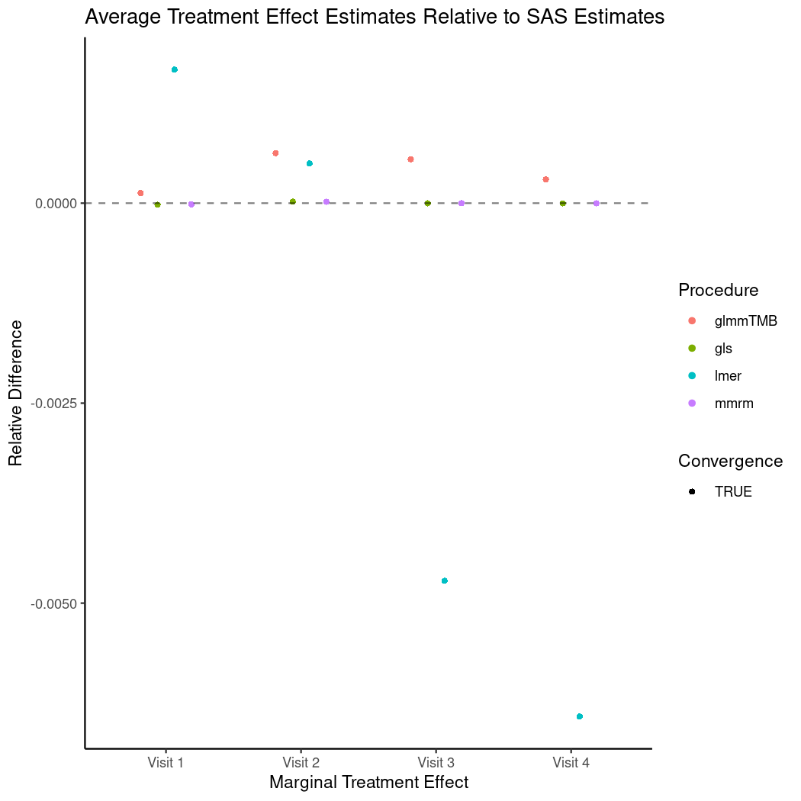
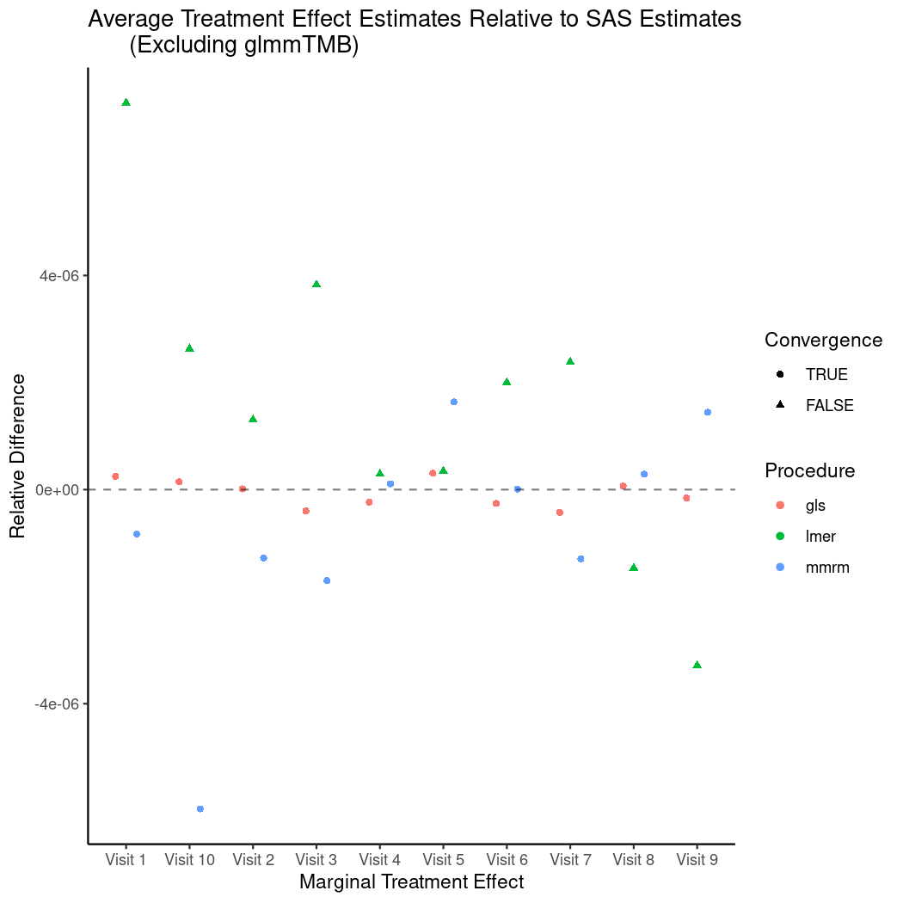

# Introduction

In this vignette we briefly compare the `mmrm::mmrm`, SAS's `PROC MIXED`,
`nlme::gls`, `lme4::lmer`, and `glmmTMB::glmmTMB` functions for fitting mixed
models for repeated measures (MMRMs). A primary difference in these
implementations lies in the covariance structures that are supported "out of the
box". In particular, `PROC MIXED` and `mmrm` are the only procedures which
provide support for many of the most common MMRM covariance structures. Most
covariance structures can be implemented in `gls`, though users are required to
define them manually. `lmer` and `glmmTMB` are more limited. We find that
`mmmrm` converges more quickly than other R implementations while also producing
estimates that are virtually identical to `PROC MIXED`'s.

# Datasets

Two datasets are used to illustrate model fitting with the `mmrm`, `lme4`,
`nlme`, `glmmTMB` R packages as well as `PROC MIXED`. These data are also used
to compare these implementations' operating characteristics.

## FEV Data

The FEV dataset contains measurements of FEV1 (forced expired volume in one
second), a measure of how quickly the lungs can be emptied. Low levels of FEV1
may indicate chronic obstructive pulmonary disease (COPD). It is summarized below.

```
                                      Stratified by ARMCD
                               Overall       PBO           TRT
  n                              800           420           380
  USUBJID (%)
     PT[1-200]                   200           105 (52.5)     95 (47.5)
  AVISIT
     VIS1                        200           105            95
     VIS2                        200           105            95
     VIS3                        200           105            95
     VIS4                        200           105            95
  RACE (%)
     Asian                       280 (35.0)    152 (36.2)    128 (33.7)
     Black or African American   300 (37.5)    184 (43.8)    116 (30.5)
     White                       220 (27.5)     84 (20.0)    136 (35.8)
  SEX = Female (%)               424 (53.0)    220 (52.4)    204 (53.7)
  FEV1_BL (mean (SD))          40.19 (9.12)  40.46 (8.84)  39.90 (9.42)
  FEV1 (mean (SD))             42.30 (9.32)  40.24 (8.67)  44.45 (9.51)
  WEIGHT (mean (SD))            0.52 (0.23)   0.52 (0.23)   0.51 (0.23)
  VISITN (mean (SD))            2.50 (1.12)   2.50 (1.12)   2.50 (1.12)
  VISITN2 (mean (SD))          -0.02 (1.03)   0.01 (1.07)  -0.04 (0.98)
```

## BCVA Data

The BCVA dataset contains data from a randomized longitudinal ophthalmology
trial evaluating the change in baseline corrected visual acuity (BCVA) over the
course of 10 visits. BCVA corresponds to the number of letters read from a
visual acuity chart. A summary of the data is given below:

```
                                      Stratified by ARMCD
                               Overall         CTL            TRT
  n                             8605          4123           4482
  USUBJID (%)
     PT[1-1000]                 1000           494 (49.4)     506 (50.6)
  AVISIT
     VIS1                        983           482            501
     VIS2                        980           481            499
     VIS3                        960           471            489
     VIS4                        946           458            488
     VIS5                        925           454            471
     VIS6                        868           410            458
     VIS7                        816           388            428
     VIS8                        791           371            420
     VIS9                        719           327            392
     VIS10                       617           281            336
  RACE (%)
     Asian                       297 (29.7)    151 (30.6)     146 (28.9)
     Black or African American   317 (31.7)    149 (30.1)     168 (33.2)
     White                       386 (38.6)    194 (39.3)     192 (37.9)
  BCVA_BL (mean (SD))          75.12 (9.93)  74.90 (9.76)   75.40 (10.1)
  BCVA_CHG (mean (SD))
     VIS1                       5.59 (1.31)   5.32 (1.23)    5.86 (1.33)
     VIS10                      9.18 (2.91)   7.49 (2.58)   10.60 (2.36)
```


# Model Implementations {.tabset}

Listed below are some of the most commonly used covariance structures used when
fitting MMRMs. We indicate which matrices are available "out of the box" for
each implementation considered in this vignette. Note that this table is not
exhaustive; `PROC MIXED` and `glmmTMB` support additional spatial covariance
structures.

| Covariance structures             | `mmrm` | `PROC MIXED` | `gls` | `lmer` | `glmmTMB` |
|:---------------------------------:|:------:|:------------:|:-----:|:------:|:---------:|
| Ante-dependence (heterogeneous)   | X      | X            |       |        |           |
| Ante-dependence (homogeneous)     | X      |              |       |        |           |
| Auto-regressive (heterogeneous)   | X      | X            | X     |        |           |
| Auto-regressive (homogeneous)     | X      | X            | X     |        | X         |
| Compound symmetry (heterogeneous) | X      | X            | X     |        | X         |
| Compound symmetry (homogeneous)   | X      | X            | X     |        |           |
| Spatial exponential               | X      | X            | X     |        | X         |
| Toeplitz (heterogeneous)          | X      | X            |       |        | X         |
| Toeplitz (homogeneous)            | X      | X            |       |        |           |
| Unstructured                      | X      | X            | X     | X      | X         |

Code for fitting MMRMs to the FEV data using each of the considered functions
and covariance structures are provided below. Fixed effects for the visit
number, treatment assignment and the interaction between the two are modeled.

## Ante-dependence (heterogeneous)

### `PROC MIXED`
<pre><code>PROC MIXED DATA = fev_data cl method=ml;
CLASS AVISIT(ref = 'VIS1') ARMCD(ref = 'PBO') USUBJID;
MODEL FEV1 = AVISIT|ARMCD / ddfm=satterthwaite solution chisq;
<b>REPEATED AVISIT / subject=USUBJID type=ANTE(1)</b> r=1, 2, 3, 4, 5, 6, 7, 8, 9, 10 rcorr;
</code></pre>

### `mmrm`
<pre><code>mmrm(
  formula = FEV1 ~ ARMCD * AVISIT + <b>adh(VISITN | USUBJID)</b>,
  data = fev_data
)
</code></pre>

## Ante-dependence (homogeneous)

### `mmrm`
<pre><code>mmrm(
  formula =FEV1 ~ ARMCD * AVISIT + <b>ad(VISITN | USUBJID)</b>,
  data = fev_data
)
</code></pre>

## Auto-regressive (heterogeneous)

### `PROC MIXED`
<pre><code>PROC MIXED DATA = fev_data cl method=ml;
CLASS AVISIT(ref = 'VIS1') ARMCD(ref = 'PBO') USUBJID;
MODEL FEV1 = AVISIT|ARMCD / ddfm=satterthwaite solution chisq;
<b>REPEATED AVISIT / subject=USUBJID type=ARH(1)</b> r=1, 2, 3, 4, 5, 6, 7, 8, 9, 10 rcorr;
</code></pre>

### `mmrm`
<pre><code>mmrm(
  formula = FEV1 ~ ARMCD * AVISIT + <b>ar1h(VISITN | USUBJID)</b>,
  data = fev_data
)
</code></pre>

### `gls`
<pre><code>gls(
  formula = FEV1 ~ ARMCD * AVISIT,
  data = fev_data,
  correlation = <b>corCAR1(form = ~AVISIT | USUBJID)</b>,
  weights = <b>varIdent(form = ~1|AVISIT)</b>,
  na.action = na.omit
)
</code></pre>

## Auto-regressive (homogeneous)

### `PROC MIXED`
<pre><code>PROC MIXED DATA = fev_data cl method=ml;
CLASS AVISIT(ref = 'VIS1') ARMCD(ref = 'PBO') USUBJID;
MODEL FEV1 =  ARMCD|AVISIT / ddfm=satterthwaite solution chisq;
<b>REPEATED AVISIT / subject=USUBJID type=AR(1)</b> r=1, 2, 3, 4, 5, 6, 7, 8, 9, 10 rcorr;
</code></pre>

### `mmrm`
<pre><code>mmrm(
  formula = FEV1 ~ ARMCD * AVISIT + <b>ar1(VISITN | USUBJID)</b>,
  data = fev_data
)
</code></pre>

### `gls`
<pre><code>gls(
  formula = FEV1 ~ ARMCD * AVISIT,
  data = fev_data,
  correlation = <b>corCAR1(form = ~AVISIT | USUBJID)</b>,
  na.action = na.omit
)
</code></pre>

### `glmmTMB`
<pre><code>glmmTMB(
  FEV1 ~ ARMCD * AVISIT + <b>ar1(0 + AVISIT | USUBJID)</b>,
  <b>dispformula = ~ 0</b>,
  data = fev_data
)
</code></pre>

## Compound symmetry (heterogeneous)

### `PROC MIXED`
<pre><code>PROC MIXED DATA = fev_data cl method=ml;
CLASS AVISIT(ref = 'VIS1') ARMCD(ref = 'PBO') USUBJID;
MODEL FEV1 = AVISIT|ARMCD / ddfm=satterthwaite solution chisq;
<b>REPEATED AVISIT / subject=USUBJID type=CSH</b> r=1, 2, 3, 4, 5, 6, 7, 8, 9, 10 rcorr;
</code></pre>

### `mmrm`
<pre><code>mmrm(
  formula = FEV1 ~ ARMCD * AVISIT + <b>csh(VISITN | USUBJID)</b>,
  data = fev_data
)
</code></pre>

### `gls`
<pre><code>gls(
  formula = FEV1 ~ ARMCD * AVISIT,
  data = fev_data,
  correlation = <b>corCompSymm(form = ~AVISIT | USUBJID)</b>,
  weights = <b>varIdent(form = ~1|AVISIT)</b>,
  na.action = na.omit
)
</code></pre>

### `glmmTMB`
<pre><code>glmmTMB(
  FEV1 ~ ARMCD * AVISIT + <b>cs(0 + AVISIT | USUBJID)</b>,
  <b>dispformula = ~ 0</b>,
  data = fev_data
)
</code></pre>

## Compound symmetry (homogeneous)

### `PROC MIXED`
<pre><code>PROC MIXED DATA = fev_data cl method=ml;
CLASS AVISIT(ref = 'VIS1') ARMCD(ref = 'PBO') USUBJID;
MODEL FEV1 = AVISIT|ARMCD / ddfm=satterthwaite solution chisq;
<b>REPEATED AVISIT / subject=USUBJID type=CS</b> r=1, 2, 3, 4, 5, 6, 7, 8, 9, 10 rcorr;
</code></pre>

### `mmrm`
<pre><code>mmrm(
  formula = FEV1 ~ ARMCD * AVISIT + <b>cs(VISITN | USUBJID)</b>,
  data = fev_data
)
</code></pre>

### `gls`
<pre><code>gls(
  formula = FEV1 ~ ARMCD * AVISIT,
  data = fev_data,
  correlation = <b>corCompSymm(form = ~AVISIT | USUBJID)</b>,
  na.action = na.omit
)
</code></pre>


## Spatial exponential

### `PROC MIXED`
<pre><code>PROC MIXED DATA = fev_data cl method=ml;
CLASS AVISIT(ref = 'VIS1') ARMCD(ref = 'PBO') USUBJID;
MODEL FEV1 = AVISIT|ARMCD / ddfm=satterthwaite solution chisq;
<b>REPEATED / subject=USUBJID type=sp(exp)(visitn)</b> rcorr;
</code></pre>

### `mmrm`
<pre><code>mmrm(
  formula = FEV1 ~ ARMCD * AVISIT + <b>sp_exp(VISITN | USUBJID)</b>,
  data = fev_data
)
</code></pre>

### `gls`
<pre><code>gls(
  formula = FEV1 ~ ARMCD * AVISIT,
  data = fev_data,
  correlation = <b>corExp(form = ~AVISIT | USUBJID)</b>,
  weights = varIdent(form = ~1|AVISIT),
  na.action = na.omit
)
</code></pre>

### `glmmTMB`
<pre><code># NOTE: requires use of coordinates
glmmTMB(
  FEV1 ~ ARMCD * AVISIT + <b>exp(0 + AVISIT | USUBJID)</b>,
  <b>dispformula = ~ 0</b>,
  data = fev_data
)
</code></pre>

## Toeplitz (heterogeneous)

### `PROC MIXED`
<pre><code>PROC MIXED DATA = fev_data cl method=ml;
CLASS AVISIT(ref = 'VIS1') ARMCD(ref = 'PBO') USUBJID;
MODEL FEV1 = AVISIT|ARMCD / ddfm=satterthwaite solution chisq;
<b>REPEATED AVISIT / subject=USUBJID type=TOEPH</b> r=1, 2, 3, 4, 5, 6, 7, 8, 9, 10 rcorr;
</code></pre>

### `mmrm`
<pre><code>mmrm(
  formula = FEV1 ~ ARMCD * AVISIT + <b>toeph(AVISIT | USUBJID)</b>,
  data = fev_data
)
</code></pre>

### `glmmTMB`
<pre><code> glmmTMB(
  FEV1 ~ ARMCD * AVISIT + <b>toep(0 + AVISIT | USUBJID)</b>,
  <b>dispformula = ~ 0</b>,
  data = fev_data
)
</code></pre>

## Toeplitz (homogeneous)

### `PROC MIXED`
<pre><code>PROC MIXED DATA = fev_data cl method=ml;
CLASS AVISIT(ref = 'VIS1') ARMCD(ref = 'PBO') USUBJID;
MODEL FEV1 = AVISIT|ARMCD / ddfm=satterthwaite solution chisq;
<b>REPEATED AVISIT / subject=USUBJID</b> <b>type=TOEP</b> r=1, 2, 3, 4, 5, 6, 7, 8, 9, 10 rcorr;
</code></pre>

### `mmrm`
<pre><code>mmrm(
  formula = FEV1 ~ ARMCD * AVISIT + <b>toep(AVISIT | USUBJID)</b>,
  data = fev_data
)
</code></pre>

## Unstructured

### `PROC MIXED`
<pre><code>PROC MIXED DATA = fev_data cl method=ml;
CLASS AVISIT(ref = 'VIS1') ARMCD(ref = 'PBO') USUBJID;
MODEL FEV1 = ARMCD|AVISIT / ddfm=satterthwaite solution chisq;
<b>REPEATED AVISIT / subject=USUBJID</b> <b>type=un</b> r=1, 2, 3, 4, 5, 6, 7, 8, 9, 10 rcorr;
</code></pre>

### `mmrm`
<pre><code>mmrm(
  formula = FEV1 ~ ARMCD * AVISIT + <b>us(AVISIT | USUBJID)</b>,
  data = fev_data
)
</code></pre>

### `gls`
<pre><code>gls(
  formula = FEV1 ~  ARMCD * AVISIT,
  data = fev_data,
  correlation = <b>corSymm(form = ~AVISIT | USUBJID)</b>,
  weights = varIdent(form = ~1|AVISIT),
  na.action = na.omit
)
</code></pre>

### `lmer`
<pre><code>lmer(
  FEV1 ~ ARMCD * AVISIT + <b>(0 + AVISIT | USUBJID)</b>,
  data = fev_data,
  control = lmerControl(check.nobs.vs.nRE = "ignore"),
  na.action = na.omit
)
</code></pre>

### `glmmTMB`
<pre><code>glmmTMB(
  FEV1 ~ ARMCD * AVISIT + <b>us(0 + AVISIT | USUBJID)</b>,
  <b>dispformula = ~ 0</b>,
  data = fev_data
)
</code></pre>


# Benchmarking

Next, the MMRM fitting procedures are compared using the FEV and BCVA datasets.
FEV1 measurements are modeled as a function of race, treatment arm, visit
number, and the interaction between the treatment arm and the visit number.
Change in BCVA is assumed to be a function of race, baseline BCVA, treatment
arm, visit number, and the treatment--visit interaction. In both datasets,
repeated measures are modeled using an unstructured covariance matrix. The
implementations' convergence times are evaluated first, followed by a comparison
of their estimates. Finally, we fit these procedures on simulated BCVA-like data
to assess the impact of missingness on convergence rates.

## Convergence Times

### FEV Data

The `mmrm`, `PROC MIXED`, `gls`, `lmer`, and `glmmTMB` functions are applied to
the FEV dataset 10 times. The convergence times are recorded for each replicate
and are reported in the table below.


Table: Comparison of convergence times: milliseconds

|Implementation | Median| First Quartile| Third Quartile|
|:--------------|------:|--------------:|--------------:|
|mmrm           |  55.03|          55.00|          55.06|
|lmer           | 236.58|         235.19|         246.55|
|gls            | 680.56|         676.58|         692.96|
|glmmTMB        | 681.96|         678.29|         683.28|

It is clear from these results that `mmrm` converges significantly faster than
other R functions. Though not demonstrated here, this is generally true
regardless of the sample size and covariance structure used. `PROC MIXED` is the
fastest procedure on average, however.

### BCVA Data

The MMRM implementations are now applied to the BCVA dataset 10 times. The
convergence times are presented below.


Table: Comparison of convergence times: seconds

|Implementation | Median| First Quartile| Third Quartile|
|:--------------|------:|--------------:|--------------:|
|mmrm           |   3.34|           3.32|           3.36|
|glmmTMB        |  17.93|          17.86|          18.68|
|lmer           | 153.43|         150.52|         161.13|
|gls            | 160.73|         156.37|         163.01|

We again find that `PROC MIXED` produces the fastest convergence times on
average, followed closely by `mmrm`. The latter is the fastest of the R
implementations, just as in the FEV data.

## Marginal Treatment Effect Estimates Comparison

We next estimate the marginal mean treatment effects for each visit in the FEV
and BCVA datasets using the MMRM fitting procedures. All R implementations'
estimates are reported relative to `PROC MIXED`'s estimates. Convergence status
is also reported.

### FEV Data



The R procedures' estimates are very similar to those output by `PROC MIXED`,
though `mmrm` and `gls` generate the estimates that are closest to those
produced when using SAS. All methods converge using their default optimization
arguments.

### BCVA Data



`mmrm`, `gls` and `lmer` produce estimates that are virtually identical to `PROC
MIXED`'s, while `glmmTMB` does not. This is likely explained by `glmmTMB`'s
failure to converge. Note too that `lmer` fails to converge.


## Impact of Missing Data on Convergence Rates

The results of the previous benchmark suggest that the amount of patients
missing from later time points affect certain implementations' capacity to
converge. We investigate this further by simulating data using a data-generating
process similar to that of the BCVA datasets, though with various rates of
patient dropout.

Ten datasets of 200 patients are generated each of the following levels of
missingness: none, mild, moderate, and high. In all scenarios, observations are
missing at random. The number patients observed at each visit is obtained for
one replicated dataset at each level of missingness is presented in the table
below.


Table: Number of patients per visit

|Missingness | VIS01| VIS02| VIS03| VIS04| VIS05| VIS06| VIS07| VIS08| VIS09| VIS10|
|:-----------|-----:|-----:|-----:|-----:|-----:|-----:|-----:|-----:|-----:|-----:|
|none        |   200|   200|   200|   200|   200|   200|   200|   200|   200|   200|
|mild        |   200|   199|   194|   193|   190|   190|   186|   180|   175|   160|
|moderate    |   196|   198|   197|   189|   187|   173|   167|   155|   139|   117|
|high        |   191|   192|   173|   166|   145|   130|   111|    90|    69|    49|

The convergence rates of all implementations for stratified by missingness level
is presented in the plot below.


`mmrm`, `gls`, and `PROC MIXED` are resilient to missingness, only exhibiting
some convergence problems in the scenarios with the most missingness. These
implementations converged in all the other scenarios' replicates. `glmmTMB`, on
the other hand, has convergence issues in the no-, mild-, and high-missingness
datasets, with the worst convergence rate occurring in the datasets with the
most dropout. Finally, `lmer` is unreliable in all scenarios, suggesting that
it's convergence issues stem from something other than the missing observations.

Note that the default optimization schemes are used for each method; these
schemes can be modified to potentially improve convergence rates.

A more comprehensive simulation study using data-generating processes similar to
the one used here is outlined in the
[`simulations/missing-data-benchmarks`](https://github.com/openpharma/mmrm/tree/main/simulations/missing-data-benchmarks)
subdirectory. In addition to assessing the effect of missing data on software
convergence rates, we also evaluate these methods' fit times and empirical bias,
variance, 95% coverage rates, type I error rates and type II error rates. `mmrm`
is found to be the most most robust software for fitting MMRMs in scenarios
where a large proportion of patients are missing from the last time points.
Additionally, `mmrm` has the fastest average fit times regardless of the amount
of missingness. All implementations considered produce similar empirical biases,
variances, 95% coverage rates, type I error rates and type II error rates.

# Session Information


```
#> R version 4.2.2 Patched (2022-11-10 r83330)
#> Platform: x86_64-pc-linux-gnu (64-bit)
#> Running under: Ubuntu 20.04.5 LTS
#>
#> Matrix products: default
#> BLAS:   /usr/lib/x86_64-linux-gnu/blas/libblas.so.3.9.0
#> LAPACK: /usr/lib/x86_64-linux-gnu/lapack/liblapack.so.3.9.0
#>
#> locale:
#>  [1] LC_CTYPE=en_US.UTF-8       LC_NUMERIC=C
#>  [3] LC_TIME=en_US.UTF-8        LC_COLLATE=en_US.UTF-8
#>  [5] LC_MONETARY=en_US.UTF-8    LC_MESSAGES=en_US.UTF-8
#>  [7] LC_PAPER=en_US.UTF-8       LC_NAME=C
#>  [9] LC_ADDRESS=C               LC_TELEPHONE=C
#> [11] LC_MEASUREMENT=en_US.UTF-8 LC_IDENTIFICATION=C
#>
#> attached base packages:
#> [1] stats     graphics  grDevices utils     datasets  methods   base
#>
#> other attached packages:
#>  [1] ggplot2_3.4.1           emmeans_1.8.4-1         sasr_0.1.2
#>  [4] glmmTMB_1.1.5           nlme_3.1-162            lme4_1.1-31
#>  [7] Matrix_1.5-3            stringr_1.5.0           microbenchmark_1.4.9
#> [10] purrr_1.0.1             dplyr_1.1.0             clusterGeneration_1.3.7
#> [13] MASS_7.3-58.2           knitr_1.42              mmrm_0.2.2.9045
#>
#> loaded via a namespace (and not attached):
#>  [1] reticulate_1.28     tidyselect_1.2.0    xfun_0.37
#>  [4] TMB_1.9.2           splines_4.2.2       lattice_0.20-45
#>  [7] colorspace_2.1-0    vctrs_0.5.2         generics_0.1.3
#> [10] utf8_1.2.3          rlang_1.0.6         nloptr_2.0.3
#> [13] pillar_1.8.1        glue_1.6.2          withr_2.5.0
#> [16] lifecycle_1.0.3     munsell_0.5.0       gtable_0.3.1
#> [19] mvtnorm_1.1-3       coda_0.19-4         evaluate_0.20
#> [22] labeling_0.4.2      pbkrtest_0.5.2      parallel_4.2.2
#> [25] fansi_1.0.4         highr_0.10          broom_1.0.3
#> [28] Rcpp_1.0.10         xtable_1.8-4        backports_1.4.1
#> [31] scales_1.2.1        checkmate_2.1.0     jsonlite_1.8.4
#> [34] farver_2.1.1        png_0.1-8           stringi_1.7.12
#> [37] numDeriv_2016.8-1.1 rbibutils_2.2.13    grid_4.2.2
#> [40] Rdpack_2.4          cli_3.6.0           tools_4.2.2
#> [43] magrittr_2.0.3      tibble_3.2.0        tidyr_1.3.0
#> [46] pkgconfig_2.0.3     estimability_1.4.1  minqa_1.2.5
#> [49] R6_2.5.1            boot_1.3-28.1       compiler_4.2.2
```
